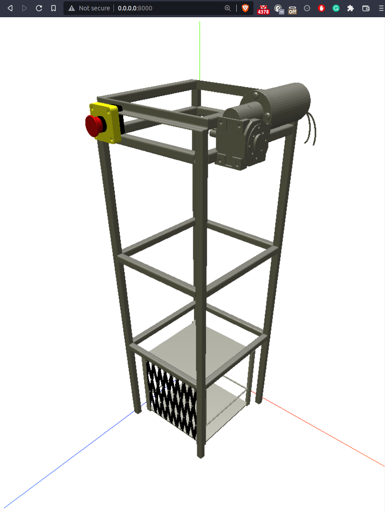

# Final Year Project: Development of a industrial IoT application with web based digital twin
<h1>
Case study: Elevator 
</h1>

## Project Description
This is a repository containing the documentation and files of the design,implementation and testing of the IIoT system by group 22. IIoT is one of the industry 4.0 technology. Our project is about connecting industrial devices to the cloud using Google cloud platform where we use the Firebase Realtime Database a cloud-hosted database to store elevator data as JSON and synchronized in Realtime to every connected client. Using Database trigger event handlers we handle on-change events of the data in the database and control and simulate floor changes on  a digital twin model of the elevator running on the web. The web based digital twin components were obtained from the data generated from the cad design. A real time cloud based digital twin will be developed

# Preview

# Table of contents
* [GroupMembers](#Group-Members)
* [DirectoryStructure](#directory-structure)
* [ProjectObjectives](#Project-Objectives)
* [SystemArchitecture](#Group-Members)

# Group-Members
1. Mwangi Maxwell Wachira
2. Ian Wanjir Owuor 
3. Amos Mosoito Mutete
4. Nduati Daniel Chege 

# DirectoryStructure
    .
    ├── Budget			    # Project budget
    ├── docs			    # Project documentation and reference material
	├── firmware			# Firmware files
			├── Rpi			# Raspberry pi firmware
			├── Esp32   	# ESP32 c/c++ firmware files
	├── images              # Image files
    ├── iot2040		    	# IoT2040 commisioning documentation
    ├── onboarding			# Mindsphere rpi onboarding documentation
    ├── res     			# welp
    ├── threejs 			# Elevator threejs boilerplate
    ├── twin     			# Elevator threejs webpack boilerplate 
	└── README.md

# Project-Objectives
1. Connect the  elevator model to the cloud.
2. Create a cloud based digital twin of the elevator system that simulates the actual elevator system real time.
3. Integrating the Individual systems so that they function together seamlessly.
4. Collect, monitor and visualize the system data real time on a cloud IOT platform.

# System architecture

# Status

# License
This project is licensed under the terms of the MIT license.
