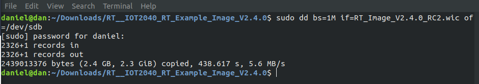
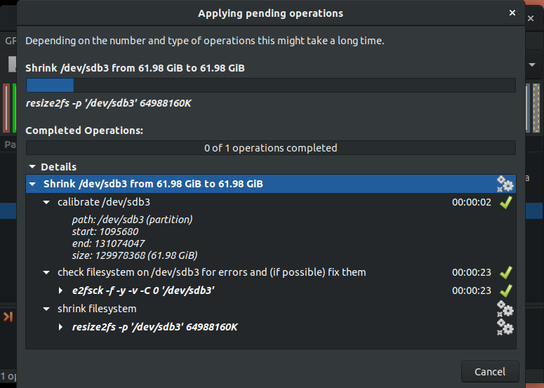
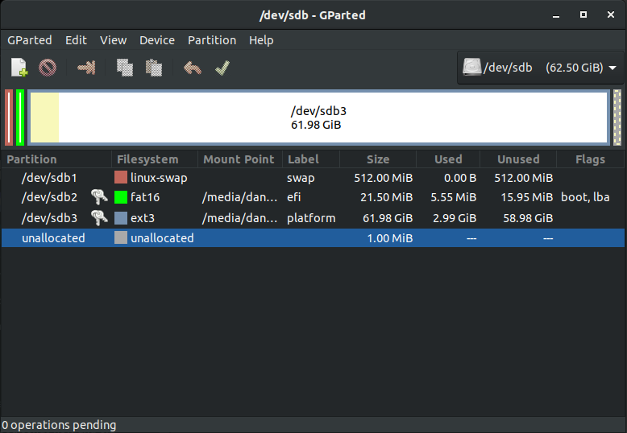
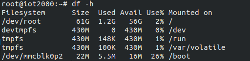
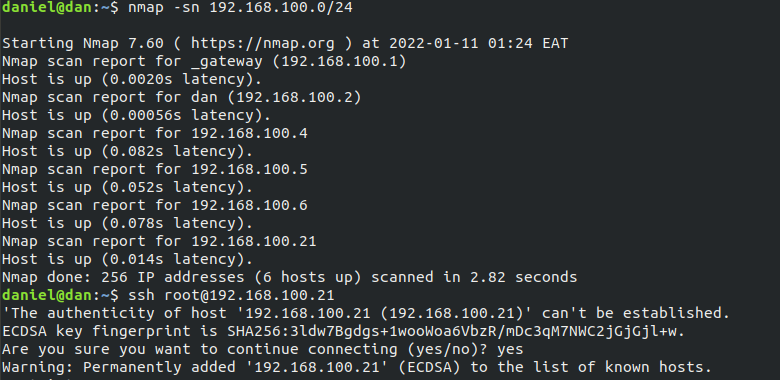

# SIMATIC IOT2000 series 
The Siemens IoT 2020 is designed for use as a gateway between industrial installations and cloud platforms. This would typically be achieved by using the Ethernet port to connect to a network with Internet access. The gateway will act as the comm. interface between our elevator and the cloud. 

# Comissioning
## Requirements
1. Siemens SIMATIC IOT2040
2. power supply (9-36v)
3. Ethernet Cable
4. SD card

## Siemens Support Portal registration
First, you must register with or have access to [Siemens Support Portal](https://support.industry.siemens.com/) to download all initial configurations. This Portal will also provide troubleshooting and support from Siemens on any hardware related inquires. 

## Download SD-Card image 
Begin by dowloading the image provided by the [Siemens Industry Online Support page](https://support.industry.siemens.com/cs/document/109741799/downloads-for-simatic-iot20x0?dti=0&lc=en-WW).
in my case i downloaded the [example_image_v3.1.1.zip](https://support.industry.siemens.com/cs/attachments/109741799/IOT2040_Example_Image_V3.1.1.zip)

## Burn image to sd card
Connect the micro sd card to your computer. I'm currently on Ubuntu 18.04.6 LTS so these instructions are linux based:
1. Navigate to the image file download directory
```bash
cd Downloads/
``` 
2. Unzip the downloaded file:
```bash
sudo unzip IOT2040_Example_Image_V3.1.1.zip
```
navigate into the unzipped directory
```bash
cd IOT2040_Example_Image_V3.1.1/
```
3. Verify the location of the SD-card to unmount it and burn the image.
```bash
df -h
```
The SD-card should be located it the directory `/dev/...` in my case the sd card is located in the following directory `/dev/sdb`
Unmount the sd card:
```bash
umount /dev/sdb
```
4. Burn the image 
```bash
sudo dd bs=1M if={name_of_the_image} of={sd_card_location}
```
In my case this is:
```bash
sudo dd bs=1M if=RT_Image_V2.4.0_RC2.wic of=/dev/sdb
```
</img>
This takes `some time`

---

## Filesysystem resizing
Prior to inserting the Micro SD card into the IoT 2040, it’s worth expanding the root file system to fill the card. I use `gparted` with the card inserted into my laptop.
</img>
</img>
</img>

---

## Install the SD-Card into the SIMATIC 2040
## Power on the device
Once the SIMATIC IOT2040 is powered on, you will see the following behavior on the LEDs of the gateway:
* `PWR`: Solid; device turned ON 
* `SD`: Flashing then Solid turned OFF -> The SD LED will be intermittent because is resizing the SD-Card, wait until the SD LED change it status to Solid turned OFF to access to the gateway.
* `USB`: Solid; device turned ON

---

## Connecting to the device
The SIMATIC IOT2000 lets you access to via Serial, SSH or Telnet.The SIMATIC IOT2000 has a static IP address by default -> `192.168.200.1` . To establish a SSH connection, your computer have the same subnet as the SIMATIC IOT2000. I found this rather tricky as my laptop does not come with an ethernet port and considering the IOT2040 brings DHCP Address by default in the Ethernet Port - X2P1 i went for this.

### SSH connection via DHCP address
The SIMATIC IOT 2040 brings DHCP Address by default in the Ethernet Port - X2P1, thus one can access it directly using the IP address assigned. So i connected one end of the Ethernet Cable to my router and the other to the Ethernet Port- X2P1 of the SIMATIC IOT2000 device. I ran a simple ip scan with nmap and ssh to the device

</img>

## OPKG package manager
---
## Python installation
---